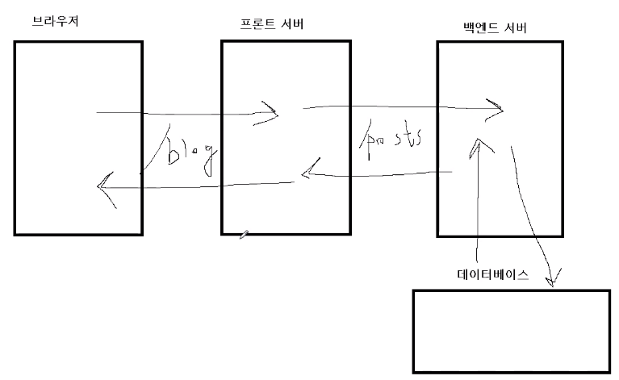
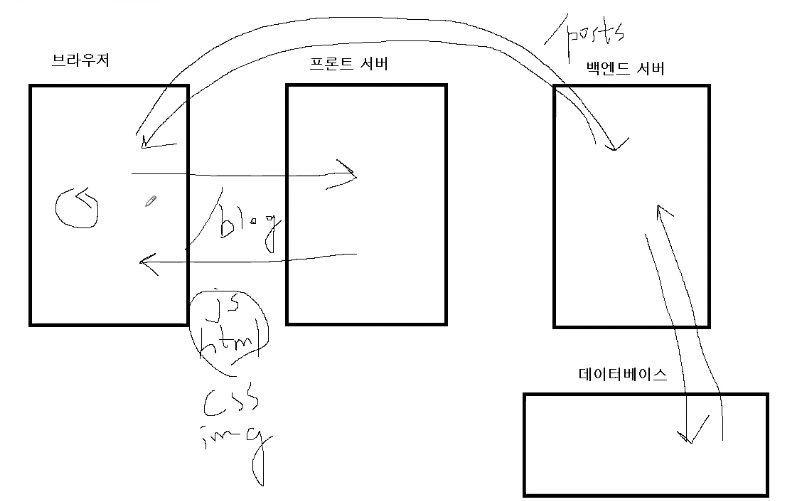
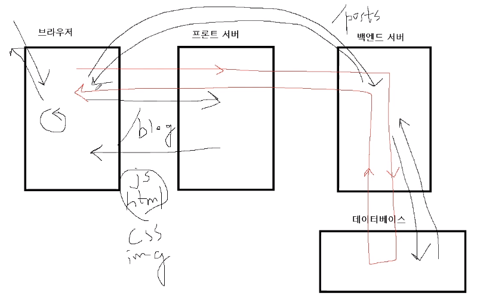
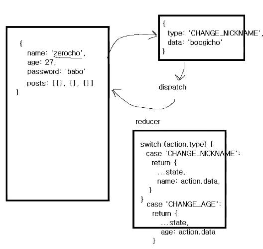
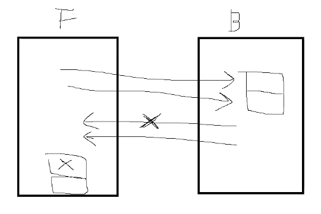
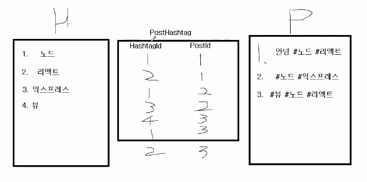
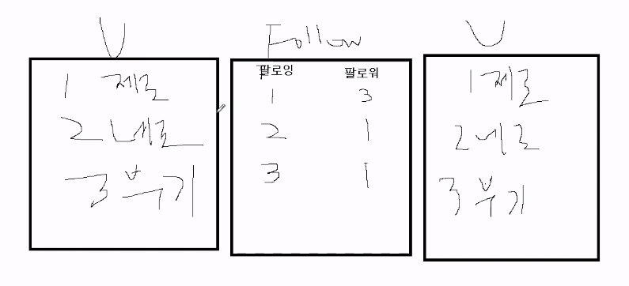
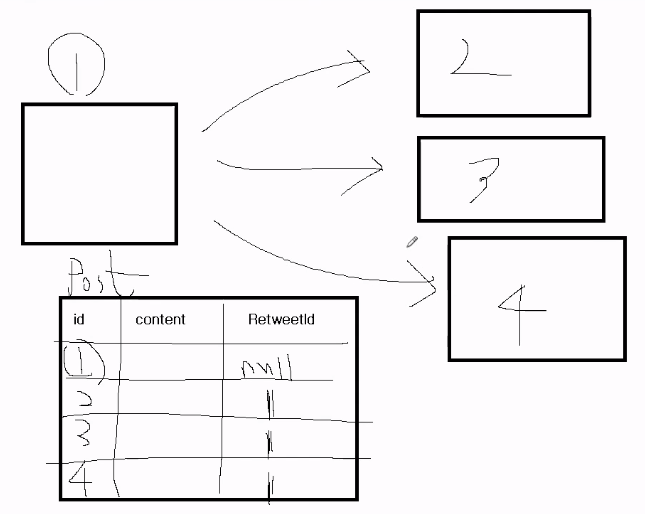
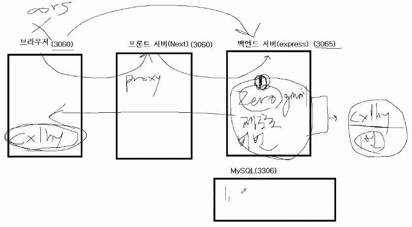

# React로 NodeBird SNS 만들기(2021 리뉴얼 강좌)

## Things to do later

- [x] antd에 dark mode 전환 있는지 알아보기
  - https://ant.design/components/menu/ 를 보면서 dark mode를 넣는 도중 body 전체에 css를 적용하기 위해 document.querySelector로 body를 가져오려고 했으나 document is not defined 에러 발생
    - next는 SSR로 동작하기 때문에 발생된 문제
      - https://helloinyong.tistory.com/248
      - 웹 페이지를 구성시킬 요소들이 렌더링 및 클라이언트로 로드 되기 전에 document에 접근해서 발생한 문제
        - ComponentDidMount를 이용해서 해결했다고 나옴
          - useEffect를 사용해서 해결함
- [ ] global state로 페이지 전환해도 dark mode 유지하기

  - react context
    - useReducer() : 상태 업데이트 로직을 컴포넌트 밖에 작성할 수 있고, 다른파일에 작성 후 불러와서 사용 할 수 있음
      - https://www.daleseo.com/react-hooks-use-reducer/
      - const [state,dispatch] = useReducer(reducer, initialState);
        - state : 컴포넌트에서 사용 할 수 있는 상태
        - dispatch : 액션을 발생시키는 함수
        - 첫번째 인자(reducer) : reducer 함수
        - 두번째 인자(initialState) : 초기값
  - redux

- [x] github pull request 내용 정리
  - [블로그에 정리](https://velog.io/@gth1123/github%EC%9C%BC%EB%A1%9C-%ED%98%91%EC%97%85pull-request)

## 0. Hello, Next.js

### 0-1. 리뉴얼 강좌 소개

<details>
<summary>기존 강좌에 비해 바뀐 점</summary>

- next가 8에서 9로 바뀜 : 훨씬 편리해 짐
- vue의 nuxt가 훨씬 편했던 기능들이 next로 많이 넘어옴
  - typescript 지원
  - 프론트에서 커스텀 서버 -> 동적라우팅 -> 넉스트 처럼 동적 라우팅 가능
- API라우트 => 백엔드도 어느정도 프론트에서 커버 가능해짐
- static optimization : 페이지들을 미리 빌드해놓음
  - 미리 빌드해놓지 않으면 브라우저에서 서버로 요청이 왔을 때 그때 그때 빌드해줘야 되는데 미리 빌드를 해놨기 때문에 응답 속도가 빨라짐(성능적으로도 최적화가 됨)
- 개발할 때 로그도 자세하게 나옴

디자인 라이브러리 : ant design

- ant design도 3에서 4버전으로 바뀜
  - 아이콘, form 부분만 살짝 바뀜

강좌 진행방식의 변경

- 약 400건의 질문을 바탕으로 강좌 순서 및 설명을 조정
- 프론트 입장과 백엔드 입장을 나눠서 프론트라고 가정하면 가상의 백엔드 개발자와 협업을 한다고 생각
  - chapter 4까진 프론트 개발자 입장으로 백엔드 개발자가 api를 알려준다고 가정
  - 또는 백엔드가 안만들어져있으면 프론트 개발자가 더미데이터를 사용해서 개발을 진행함 - 더미데이터로 프론트 화면을 먼저 만들어 볼 에정

[강좌 깃헙](https://github.com/ZeroCho/react-nodebird/tree/master)

</details>

리액트에 next를 추가로 선택한 이유 - 실무와 관련있음

- 리액트를 사용한 프레임 워크가 next
  - 장점 : 실무를 위해서 갖춰진 것들이 많음
  - 단점 : 프레임워크 특성상 정해진 틀 안에서 코딩을 해야돼서 자유도는 떨어짐
  - 가장 큰 장점 : SSR

전통적인 SSR(server side rendering)


SPA(CSR) 렌더링 방식 - ex) React, Vue, Angular


### 0-2. Next.js 역할 소개

SSR과 CSR의 장단점

CSR
장점

- 일단 로딩되면 모바일 앱같은 부드러운 화면 전환 등 사용자 경험이 좋음

단점

- 로딩속도가 오래걸림
  - 요즘은 3초 이내에 화면이 보이지 않으면 사용자가 떠난다고 함
  - 적어도 로딩창이라도 보이면 인내심이 늘어남
- 검색엔진이 방문을 했을 때 보여지는게 로딩창 밖에 없는 것 처럼 보일 수 있음
  - 검색엔진에서 순위가 뒤로 밀려날 수 있음

next를 이용한 SSR

- 모든페이지를 다 받아오지 않고 코드스플릿팅이란 기술로 방문한 페이지만 보내주게 함
  - 실무에선 반드시 적용해야 함(검색엔진 노출이 대부분의 서비스에서 중요하기 때문)
    - 사용자를 대상으로 하는 페이지는 속도도 빨라야 하므로 코드 스플릿팅도 적용해야 함

next의 SSR의 종류 두 가지

1. pre render
   - 검색엔진일 때만 backend server에서 데이터를 받아와서 HTML을 완성해서 줌
   - 일반 유저일 땐 기존 리액트방식으로 줌
2. server side rendering
   
   - 첫 방문만 전통적인 방법대로 하고 그 다음 페이지 전환일 땐 리액트 방식으로(하이브리드 방식)

next는 언제쓰고 언제 쓰지 말아야 할까?

1. 코드스플릿팅, SSR 둘다 필요없는 경우 : admin page
2. 그런데 웬만한 커스터머(B2C) 서비스는 SSR을 지원하는 프레임워크를 고려하는게 좋음
   - next만 되는 것은 아님, 리액트로도 SSR과 코드스플릿팅이 가능함
     - [오픈소스 진행중](https://github.com/reactGo/reactGo)
       - 제로초님의 정부지원받아서 진행 중인 프로젝트

### 0-3. 실전예제와 준비사항

vscode, nodejs, npm

### 0-4. Next.js 실행해보기

<details>
<summary>설치 및 실행(Hello world)</summary>
front 폴더 생성

front폴더에서 npm init

- cd front
- npm init
  - package name만 적고 나머지 엔터

front에서 npm i next

- 강좌와 같이 9버전으로 설치하고 싶으면 npm i next@9
- 여기선 그냥 최신 버전으로 설치했음(^11.0.1)

package.json에 스크립트 추가

- "dev" : "next"

import React from 'react'; 가 next에선 필요 없음

- next에선 pages폴더는 무조건 이름이 pages이어야 함
  - pages안에 있는 파일들을 코드스플릿트된 개별적인 컴포넌트로 만들어줌

npm run dev == npm run next

- react, react-dom not found : react와 react-dom이 없음
  - npm i react react-dom
    - 한번에 두개의 패키지 설치 가능
  - **강좌(9버전)에선 뜨던 에러가 최신버전에선 안뜸**
    - 완전히 next 설치할때 자동으로 같이 설치된 것 같음

gitignore 파일을 설정을 안해서 node_module이 통째로 올라갔는데 이런 븅신같은 짓을 되돌릴 방법(git을 이용해서)을 찾아보기

- git revert <되돌릴 커밋>
  - 리드미에 작성된 내용같은 것들이 전부 날라갈 것 같으므로 그냥 진행
- .next, front/node_module, package-lock.json 삭제 후 push 한다음 재설치 후 다시 push
  - npm i
  - 이번엔 gitignore 덕분에 node_module은 안올라 갈 듯

</details>

- [x] nextjs용 gitignore 파일 작성 방법 알아보기
  - 현재 문의 중 구글에 gitignore nextjs로 검색하면 안나옴
  - 일단 강좌의 ignore파일을 그대로 가져옴
  - .next node_modules .env 세 개 있으면 됨

### 0-5. page와 레이아웃

페이지들 만들고 인식을 못 하면 ctrl+c로 서버 껏다가 다시 시작(npm run dev)

ㅁㅊ 라우터 설정 없이도 그냥 되네? pages폴더안에 만들어 놓기만 하면
와 404 페이지도 자동으로 만들어져있네

pages 폴더 안에 폴더를 만들면 그게 router 2차 경로임 존나 편함

- [x] React로 라우터 손수 지정한 것과 비교
<details>
<summary>세부내용</summary>

next.js는 pages폴더 안에 만들면 자동으로 라우터 설정이 된다.

react는 react-router-dom으로 부터 router를 import하고
그 안에 한땀 한땀 넣어 줘야 한다.

```javascript
import React from 'react';
import {
  HashRouter as Router,
  Route,
  Redirect,
  Switch,
} from 'react-router-dom';
import Home from '../Routes/Home';
import TV from '../Routes/TV';
import Header from './Header';
import Search from '../Routes/Search';
import Detail from '../Routes/Detail';

export default () => (
  <Router>
    <>
      <Header />
      <Switch>
        <Route path="/" exact component={Home} />
        <Route path="/tv" component={TV} />
        <Route path="/search" component={Search} />
        <Route path="/movie/:id" component={Detail} />
        <Route path="/show/:id" component={Detail} />
        <Redirect from="*" to="/" />
      </Switch>
    </>
  </Router>
);
```

</details>

pages/about/[name].js (동적 라우팅 기능 - 9버전에서 추가 됨)

- 동적으로 최종경로의 이름을 바꾸고 싶을 때

component들을 쪼갠 것은 components dir안에 파일추가 하면 됨

- pages처럼 components라는 dir이름은 고정된 것은 아님

npm i prop-types

- typescript에선 필요없음

각 페이지 별로 레이아웃을 다르게 적용하고 싶으면
AppLayout 컴포넌트 말고도 OtherLayout같은 것을 만들어서
원하는 페이지에 다른 레이아웃 컴포넌트로 감싸면 됨

git파일이 front밖에 있기 때문에 node-bird로 나와서 commit, push 해줘야 됨

- 안그러면 front안에 있는 것만 업로드 됨

### 0-6. Link와 eslint

npm run dev로 실행할 때 package.json파일이 front에 있기 때문에 cd front해야 서버를 오픈할 수 있음

Link태그

- react의 Link 태그(react-router-dom으로 부터)는 next에선 next/link에서 가져옴

```javascript
<Link href="/">
  <a>노드버드</a>
</Link>
```

- href를 a태그가 아닌 Link태그에 적어야 함
- [x] 여기서 왜 a 태그를 안에 썻을까?
  - 안넣어도 상관이 없다, Link tag안에 children이 string일 경우 자동으로 a태그가 붙기 때문
  - a태그를 넣으면 위 조건이 해당되지 않아서 그냥 넘어가게 된다.
  - [참고 문헌](https://uchanlee.dev/nextjs/Why-using-a-tag-in-nextjs-Link/)

eslint

- 리액트 개발할 때 많이 쓰이는 코드 점검용 툴
- npm i eslint -D
  - -D:개발용으로만 쓰인다는 뜻
- npm i eslint-plugin-import -D
- npm i eslint-plugin-react -D
- npm i eslint-plugin-react-hooks -D
- 여러 사람이 코딩해도 한사람이 한 것 처럼 깔끔하게 보여짐
  - 코드 룰을 정해줌

.eslintrc

- 확장자 없는 파일, linux에선 앞에 .이 붙으면 숨김 파일이 됨

eslint 설치 후 빨간 불 없애기 위해 import React 등 추가 하고 propTypes의 오타도 수정함

### 0-7. Q&A

<details>
<summary>QnA 세부 내용</summary>

material design vs ant design

- 개인 선호도 차이
- 제로초님은 부트스트랩도 사용하고 아무것도 사용하지 않은 CSS만으로도 개발함
- 디자이너가 디자인시스템을 갖춰놨다면 쉽게 개발 가능

dynamic routing

- next 9버전 부터 편해짐(더 이상 커스텀 front-end 서버를 만들 필요가 없어짐)
  - [ ] 커스텀 프론트 엔드 서버란?
- dynamic routing, api routing 기능이 추가 됨
  - [ ] 각각 뭔지 확인

CORS는 신경안써도 되나요?

- 신경써야됩니다.

  - 브라우저 - 백엔드간 요청에 CORS 설정이 필요
  - 백엔드서버와 프론트엔드 서버의 도메인이 다르기 때문에(포트만 달라도 CORS 걸림 - 백엔드 서버에서 CORS 설정 해야 함)
  - 프론트에서도 쿠키보낸거 with credential 같은 거
  - 브라우저와 프론트서버끼리는 CORS가 적용안되는데 프론트서버와 백엔드 서버 간엔 CORS 설정이 필요함
  - node가 두개임(프론트, 백)
    - 지금까지 나는 프론트를 github page나 netlify같은 곳에서만 사용했지만 실제론 서버를 임대해서 node 설치 후 프론트용 서버를 만들어줘야 되는 것 같다.
      - 이 부분은 나중에 배포할때 다시 알아보자

- [x] CORS 관련 공부

<details>
<summary>CORS details</summary>

출처

- https://youtu.be/bW31xiNB8Nc
- https://velog.io/@jesop/SOP%EC%99%80-CORS

SOP : Same-Origin Policy

- 하나의 출처(Origin)에서 로드된 자원(문서나 스크립트)이 호스트나 프로토콜, 포트번호가 일치하지 않는 자원과 상호작용 하지 못 하도록 요청발생을 제한하고, 동일출처에서만 접근이 가능한 정책

CORS : Cross-Origin Resource Sharing

- 다른 출처의 리소스를 불러오려면 그 출처(백엔드쪽)에서 올바른 CORS헤더를 포함한 응답을 반환해야 한다.
- 1. 서버에서 Access-Control-allow-origin 헤더 추가
  - 브라우저가 확인 후 포함되어 있으면 안전한 요청으로 간주
- 2. Proxy sever를 사용한다면 프록시 서버에서 Access-Control-allow-origin: \* 헤더를 담아서 응답
- 3. webpack-dev-server proxy
  - 프론트엔드에서 webpack-dev-server proxy 기능을 사용하면 서버쪽 코드를 수정하지 않고 해결 할 수 있음
- 토큰 등 사용자 식별 정보가 담긴 요청에 대해선 더 엄격함
  - 브라우저에 저장된 쿠키가 나쁘게 사용되지 않기 위함
  - 보내는 측 : credentials 항목을 true로 세팅
  - 받는 쪽 : 아무출처나 다 받는 와일드 카드가 아니라 보내는 쪽의 출처, 웹페이지 주소를 정확히 명시한 다음 Access-Control-Allow-Credentials 항목을 true로 맞춰줘야 함
  </details>

코드 스플리팅

- CSR일 때 브라우저에서 프론트 서버로 갔다가 돌려주는데 그 때 모든화면을 다 담아서 돌려줌
  - 비효율 적
- js파일을 쪼개서 원하는 페이지만 불러오는 것
  - 다른 페이지를 들어가면 그 페이지에 해당하는 부분을 프론트서버에서 받아옴
  - 기존 CSR은 처음에만 프론트에서 받아오고 이후 백엔드와 통신을 하지만 코드스플릿팅을 한 앱의 경우엔 필요할때 마다 프론트서버에서 페이지를 받아오고 데이터는 백엔드에서 받아옴

간단한 웹페이지에 리액트를 굳이 사용할 필요는 없음

- 리액트를 사용하는 주된 목적은 고객 경험이다.
- 리액트를 사용하면 웹사이트가 아니라 모바일같은 웹앱을 사용하는 고객경험을 줄 수 있음

SSR을 할거냐 말거냐는 검색엔진에 나와야 되면 SSR을 해야되고
아니면 리액트만으로도 된다.

mongoDB는 굳이 쓸 필요가 없다. SQL쓰는게 더 낫다.

- 웬만한 서버는 데이터들간 관계가 있음
  - 상품과 성분 같이 N:N(다 대 다) 관계 등 또는 고객과 제품간의 1:N관계 같이 관계가 있으면 SQL쓰는게 정답임
- mongoDB는 관계가 없거나 데이터가 지멋대로 들어올 때
  - 로그 쌓을 때 : 여러가지 케이스들에 대처하기 위해
    - 로그라는 테이블 안에 로그인, 구매날짜, 구매 내역 등

Vue, React 둘다 하기보단 React를 먼저 깊게 파고 나중에 취직 후 Vue를 React 수준으로 끌어 올리는게 좋다.

서버에서 각 페이지나 데이터를 캐싱할 수 있어서 굳이 매번 서버에서 렌더를 해서 주는게 아니라 서버에 갔다가 캐싱되어 있는 페이지를 주면 더 빠름

</details>

## 1. antd 사용해 SNS 화면 만들기

백엔드 개발자가 데이터, API가 준비가 안된 상태라고 가정하고
프론트엔드 개발자 입장에서 더미데이터로 대체해서 트위터랑 비슷하게 디자인

### 1-1. antd와 styled-components

antd

- CSS 프레임워크
- 버튼, 아이콘 등이 미리 만들어져 있음
  - 단점 : 디자인이 획일화 됨
    - 부트스트랩, 시멘틱UI, material UI 등
    - 개성이 없어짐 -> 고객이 있는 서비스에선 잘 안씀

React에 CSS를 사용하는 것은 여러가지 방법이 있다.

- 그냥 css를 쓰는 것
- SASS 또는 SCSS 등 CSS 전처리기를 사용하는 것
- styled component
- Emotion도 괜찮음(styled component와 거의 비슷)

npm trends에서 검색하면 어떤 것이 대중적인지 확인 가능

여기에선 antd와 styled-component를 사용

- npm i antd styled-components @ant-design/icons

실무에서도 admin page는 후순위로 밀리는데 antd나 bootstrap을 써도 됨

메뉴창(AppLayout.js)에 적용 : 공식 문서 보면서 하면 됨, 외울 필요 없음

### 1-2. \_app.js와 Head

antd를 react와 연결하는 방법

- 공식사이트의 Docs에서 설치방법을 봐야 함
- next에 webpack이 들어 있는데 webpack이 CSS를 보면 스타일 태그로 바꿔서 HTML로 넣어줌

  - import 'antd/dist/antd.css';
    - 공통적으로 사용 되므로 pages폴더 안에 \_app.js
      - index.js의 부모 컴포넌트임
      - [x] \_app.js를 next는 자동으로 index보다 더 최상위 컴포넌트로 인식하는건가? 일단 돌아가는거 보면 그렇게 보이긴함
        - 맞다. 제일 최상위에 \_document도 있다.
          - https://geonlee.tistory.com/224

- [x] PropTypes.elementType과 PropTypes.node 차이
  - 거의 같은데 elementType은 React전용 인지 확인하는 것이고 node는 모든 node를 의미 함
    - https://www.npmjs.com/package/prop-types

\_app.js 안에는 공통적인 것들을 모두 적어주면 됨

- 공통메뉴
- Head태그안의 title
  - next에서 Head태그를 제공을 함
  - [x] React에선 헬멧
    - React에선 react-helmet-async을 설치해서 변경한다.
    - [x] react-helmet-async와 react-helmet 차이
      - https://www.npmjs.com/package/react-helmet-async
      - Provider를 사용하여 리액트 트리의 헬멧 상태를 캡슐화해야한다.
      - 뭔가 개선된 것 같음 근데 Helmet.renderStatic(), .rewind()를 사용해보지 않아서 잘 모르겠음
        - https://www.npmjs.com/package/react-helmet#server-usage
        - 서버에서 사용하려면 prerender에서 사용할 헤드 데이터를 가져와야 됨
        - react-helmet-asyncs는 그럴필요 없이 HelmetProvider로 감싸주면 되게 변경 됨
        - 나중에 혹시 사용된 코드를 보면 이해가 될 듯

<details>
<summary>HelmetProvider의 사용 예</summary>

```javascript
import React from 'react';
import ReactDOM from 'react-dom';
import { Helmet, HelmetProvider } from 'react-helmet-async';

const app = (
  <HelmetProvider>
    <App>
      <Helmet>
        <title>Hello World</title>
        <link rel="canonical" href="https://www.tacobell.com/" />
      </Helmet>
      <h1>Hello World</h1>
    </App>
  </HelmetProvider>
);
```

</details>

next로 개발할 때 페이지 전환 시 느린 이유는 개발모드일 땐 잠깐 빌드를 해서 느리지만 배포모드일땐 미리 빌드를 해놓기 때문에 걱정안해도 됨

### 1-3. 반응형 그리드 사용하기

<details>
<summary>antd로 검색창 추가</summary>

```javascript
<Menu.Item>
  <Input.Search enterButton style={{ verticalAlign: 'middle' }} />
</Menu.Item>
```

- enterButton 같은 옵션을 줄 수 있음
  - 공식문서에서 확인 가능 : 버튼을 파란색으로 만드는 것
- style={{ verticalAlign: 'middle' }} 같이 CSS옵션을 직접 부여할 수 있음
</details>

반응형, 적응형

- 적응형 : 모바일 페이지, 테블릿, 데스크탑 페이지 따로따로 만드는 것
- 반응형 : 처음엔 모바일 페이지였다가 화면이 늘어남에 따라 컴포넌트들이 재배치 되면서 화면이 바뀜(모바일 -> 테블릿 -> 데스크탑)

antd 반응형 그리드

- import { Menu, Input, **Row, Col** } from 'antd';
- 제로초 스타일
  - 1. 가로로 먼저 나눈 뒤 세로로 나눔
  - 2. 반응형을 할땐 모바일을 먼저 디자인을 해야 한다.(데스크탑 부터 하면 피곤 함)

```javascript
<Row gutter={8}>
  <Col xs={24} md={6}>
    왼쪽 메뉴
  </Col>
  <Col xs={24} md={12}>
    {children}
  </Col>
  <Col xs={24} md={6}>
    <a href="https://www.taehwango.info" target="_blank" rel="noreferrer">
      Made by Tony
    </a>
  </Col>
</Row>
// 모바일에선 Col하나당 한칸씩 배치되서 3줄이던게
// 데스크탑에선 6/24, 12/24, 6/24씩 가로로 한줄에 배치 됨
```

xs : 모바일
sm : 태블릿
md : 작은 데스크탑
gutter : column간 간격

antd는 화면세로줄(Col)이 24칸으로 나눠져 있음

a태그의 rel="noreferrer noopener"

- noreferrer : HTTP레퍼러 헤더를 넘기지 않을 수 있음(요청을 받는 쪽에서 해당 요청이 어디에서 왔는지 알 수 없음)
- noopener : 열린쪽에서 window.opener 속성으로 연쪽의 window객체에 접근 할 수 있는 것을 방지함

### 1-4. 로그인 폼 만들기

서버 없이 로그인 : 더미데이터 사용
상태를 저장 : state

```javascript
const [isLoggedIn, setIsLoggedIn] = useState(false);
```

component

- 화면 보여주는 애들

container

- 데이터 가져오는 애들(data를 가져오거나 다루는 component)
- hooks 이후 container와 component를 구분하지 않는 추세임

코딩하다가 나는 에러들을 블로그로 정리하는 것도 좋음

Form을 수작업으로 만들어도 되지만 Form관련 라이브러리를 쓰면 편함

- [ ] label 태그 알아보기

component에 props로 넘겨주는 함수(onChange 같은 것들)은 useCallback()을 사용하자 그래야 최적화가 된다.

- [x] useCallback 이란?
  - [useCallback 공식문서](https://reactjs.org/docs/hooks-reference.html#usecallback)

```javascript
const memoizedCallback = useCallback(() => {
  doSomething(a, b);
}, [a, b]);
```

- [벨로퍼트, useCallback 사용하기](https://react.vlpt.us/basic/18-useCallback.html?q=)

반복 되는 함수는들은 custom hook으로 처리 할 수 있음

- 배열 부분이 바뀌지 않는 이상 캐싱이 되어서 렌더링 최적화를 할 수 있음

### 1-5. 리렌더링 이해하기

```javascript
<div style={{ marginTop: '10px' }}>
  <Button type="primary" htmlType="submit" loading={false}>
    로그인
  </Button>
</div>
```

이런식으로 style에 객체를 바로 넣어주면 안됨 {} == {} : false 이기 때문에 리렌더링 됨

- 성능에 크게 영향이 없다면 그냥 인라인 스타일 써도 됨
- 너무 집착할 필요는 없음
  - 배포 전에 테스트해봐서 성능적으로 너무 느리면 최적화 진행(인라인 스타일)

```javascript
const ButtonWrapper = styled.div`
  margin-top: 10px;
`;
```

만약 컴포넌트를 스타일 하고 싶다면?

```javascript
const SearchInput = styled(Input.Search)`
  vertical-align: middle;
`;
```

styled component를 사용하지 않는 다면? useMemo

- useCallback vs useMemo
  - useCallback : 함수를 캐싱
  - useMemo : 값을 캐싱

```javascript
const ButtonWrapper = styled.div`
  margin-top: 10px;
`;
// 위 코드 대신
const style = useMemo(() => ({ margin-top: 10px; }), []);
<div style={style}>
  <Button type="primary" htmlType="submit" loading={false}>
    로그인
  </Button>
</div>
// 이렇게 만들어도 됨
```

=> 리렌더링 최적화

리렌더링 되면 렌더링 함수 안의 부분이 처음부터 끝까지 다시 실행되는 것은 맞지만 useCallback, useMemo을 제외하고 바뀌지 않은 부분도 제외하고 바뀐걸로 인식되는 부분만 다시 그림

### 1-6. 더미 데이터로 로그인하기

antd의 Form에 onFinish는 e.preventDefault 가 적용이 되어 있음

```javascript
const onSubmitForm = e => {
  // e.preventDefault(); // antd의 onFinish는 이미 적용되어 있음
};

return <Form onFinish={onSubmitForm}>// ...</Form>;
```

#### UserProfile component

antd의 Card component 사용

react에서 배열로 JSX 쓸 땐 key 붙여 줘야 함

```javascript
<Card
  actions={[
    <div key="twit">
      짹짹
      <br />0
    </div>,
    <div key="folowings">
      팔로잉
      <br />0
    </div>,
    <div key="followers">
      팔로워
      <br />0
    </div>,
  ]}
>
  <Card.Meta avatar={<Avatar>TH</Avatar>} title="Tony" />
</Card>
```

### 1-7. 크롬 확장 프로그램과 Q&A

```html
<a href="https://www.taehwango.info" target="_blank" rel="noreferrer noopener">
  Made by Tony
</a>
```

rel="noreferrer noopener"를 target="\_blank" 할 때 붙여줘야 함(보안)

- 새창을 열때 어떤창으로 부터 넘어왔는지 정보가 전송되는 것을 방지

react developer tools

redux dev tools

mobx dev tools

React나 Vue랑 jQuery를 같이 쓰면 안좋은 이유

- React나 Vue에서 데이터가 바뀌었을 때 알아서 화면을 다시 그려줌
- jQuery는 자기가 직접 화면을 다시 그려야 함

Echarts : 오픈소스 차트 라이브러리, 퀄리티 높음

### 1-8. 프로필 페이지 만들기

페이지나 컴포넌트 설계 할 때 큼직하게 먼저 생각하는게 좋음

```javascript
// profile 페이지
const followerList = [
  { nickname: 'tony' },
  { nickname: 'noah' },
  { nickname: 'minsu' },
];
const followingList = [
  { nickname: 'tony' },
  { nickname: 'noah' },
  { nickname: 'minsu' },
];
<AppLayout>
  <NicknameEditForm />
  <FollowList header="팔로잉 목록" data={followingList} />
  <FollowList header="팔로워 목록" data={followerList} />
</AppLayout>;
```

이후 세부 구현

Form은 귀찮은 작업들이 많으니 React-hook-form같은 라이브러리 사용할 것을 추천

- input 하나하나를 다 컨트롤 하는게 매우 번거로운 일임

컴포넌트 스타일 커스텀 : 자동완성 기능이 지원되는 css기능을 이용하는게 개인적으로 편한 것 같다

- original css 파일로 스타일을 하는 이유
- 강좌에선 styled component를 선호함(요즘은 이모션으로 넘어가는 추세)

### 1-9. 회원가입 페이지 만들기(커스텀 훅)

반복되는 hooks들의 세트가 보이면 커스텀 훅으로 만들면 편함

```javascript
const [id, setId] = useState('');
const onChangeId = useCallback(e => {
  setId(e.target.value);
}, []);

// 위 코드를 다른 곳에서도 계속 중복해서 사용하므로 hook으로 만듦
import { useState, useCallback } from 'react';

export default (initialValue = null) => {
  const [value, setValue] = useState(initialValue);
  const setValueHandler = useCallback(e => {
    setValue(e.target.value);
  }, []);

  return [value, setValueHandler];
};
```

이후

```javascript
const [id, setId] = useState('');
const onChangeId = useCallback(e => {
  setId(e.target.value);
}, []);
```

위 코드 대신

```javascript
const [id, onChangeId] = useInput('');
```

위 코드를 사용

## 2. Redux 연동하기

### 2-1. 리덕스 설치와 필요성 소개

[redux vs mobx](https://www.npmtrends.com/redux-vs-mobx)

- redux가 더 많이 사용되고 있음
- redux는 초보한테 좋고 mobx는 리액트를 어느정도 다룰 수 있는 사람한테 좋음
- redux는 코드량이 매우 많아서 생산성 측면에선 마이너스
- redux를 붙이려면 복잡한 과정이 필요함
  - next redux wrapper 라이브러리를 사용하면 좀 더 쉽게 사용가능

npm install next-redux-wrapper react-redux --save -> 공식문서
npm i redux => 강의에서 사용

app.js를 Provider로 알아서 감싸주기 때문에 next-redux-wrapper 6버전 이상부턴 감싸주면 오히려 문제가 발생함

Redux를 쓰는 이유(vs context api로 대체가 되는지)

- 여러 페이지에서 공통적으로 쓰이는 것 : 로그인한 사람 정보, 로그인 여부
- 수동으로 하려면 부모컴포넌트를 만들어서 수동으로 각각 내려줘야 함
- 중앙 데이터 저장소 역할
  - redux, mobx, react context api, apollo(graphql)
  - redux : 초보
    - 장점 : 에러가 나도 잘 해결이 됨, 추적이 잘 됨
    - 단점 : 코드량이 많아짐
  - mobx : 리액트에 익숙
    - 장점 : 코드량이 줄음
    - 단점 : 실수하면 추적하기 어려움
  - context api : 작은 앱, 가볍게 쓸 수 있음
    - 외부라이브러리(redux, mobx)와 차이점 : 비동기를 지원하기 쉬운지 어려운지
    - 중앙 저장소는 서버에서 데이터를 많이 받아옴(비동기)
      - 100% 보장이 아니라 서버문제 또는 네트워크 문제로 못 받아 올 수 있음
      - 비동기를 다룰 땐 실패에 대비해야 됨
      - 비동기 3단계
        - 요청, 받음, 실패
        - context api에서 구현하려면 직접 구현해야 함
    - component에선 데이터 요청을 안하게 도록 하기 위해 비동기 요청도 라이브러리(redux or mobx)에 맡김
    - 어차피 context api도 비동기 요청이 많으면 redux나 mobx 모양처럼 만들어짐

이렇게 보니까 리덕스 되게 잘만든 라이브러리 같은데 왜 하향세라고 할까?

### 2-2. 리덕스의 원리와 불변성

reduce에서 이름을 따옴

단점 : 코드량이 많아짐

- action(경우의 수) 하나당 reducer(처리 로직)도 하나씩 추가됨

장점 : action 추적이 쉬움

- 거꾸로 거슬러 올라갈 수도 있음



```javascript
return {
  ...state,
  name: action.data,
};
```

위 코드의 의미 : 객체를 새로 만들어서 기존의 것들은 그대로 유지하고 name만 변경하거나 추가한다.

- 객체를 새로 만들어야 변경내역이 추적이 됨(불변성)

...state는 참조관계인 인자는 참조관계를 그대로 사용하기 때문에 메모리를 아낄 수 있음

### 2-3. 리덕스 실제 구현하기

```javascript
const initialState = {
  name: 'tony',
  age: 30,
  password: 1234,
};

const changeNickname = data => {
  return {
    type: 'CHANGE_NICKNAME',
    data, // data : data
  };
};

store.dispatch(changeNickname('Tony Go'));

// (이전상태, 액션) => 다음상태
const rootReducer = (state = initialState, action) => {
  // Y 모양 처럼 두개를 받아서 하나로 축소를 함: 레듀샤
  switch (action.type) {
    case 'CHANGE_NICKNAME':
      return {
        // 항상 새로운 것을 만들어서 return
        ...state,
        name: action.data,
      };
  }
};
```

npm i react-redux : react와 redux를 연결해주는 패키지

redux로 인한 변화

```javascript
const [isLoggedIn, setIsLoggedIn] = useState('');
<UserProfile setIsLoggedIn={setIsLoggedIn} />;
에서;
const isLoggedIn = useSelector(state => state.user.isLoggedIn); // isLoggedIn이 바뀌면 알아서 re-rendering 됨
<UserProfile />;
// 데이터가 흩어져 있어서 props로 넘겨주던 것
```

useState를 사용할 일이 많이 줄어 들음

### 2-4. 미들웨어와 리덕스 데브툴즈

HYDRATE : 나중에 6강에서 설명

- getInitialProps가 거의 안쓰이고
- getStaticProps, getServerSideProps가 쓰이면서 새로 생긴 것

enhancer, compose(applyMiddleware([])) 알아보기

- enhancer : 리덕스의 기능이 확장된 것이라서 enhancer

composeWithDevTools(applyMiddleware([]))

- 히스토리가 쌓이면 메모리도 많이 잡아먹음, 중앙 데이터들이 다 보이기 때문에 보안에 취약할 수 있음(데브툴과 연결)
- 그래서 배포용엔 데브툴을 연결 안함
- saga나 thunk는 위 배열안에 넣음

npm i redux-devtools-extension

- 이게 있어야 브라우저 개발자 도구랑 연동이 됨

포트 바꾸고 싶으면 package.json 스크립트에서 next -p (포트번호)

- default는 3000번

redux dev tools

- diff : 뭐가 바뀌었는지 보여줌
- state : 전체 상태를 보여줌

### 2-5. 리듀서 쪼개기

intialstate안에 있는 것을 기준으로 파일을 나눔

reducer : 이전 state와 action을 받아서 다음 state를 돌려주는 함수

분리한 reducer는 결국 root reducer에서 합쳐줘야 함

나누면서 주의해야 될 점 : depth가 한단계 낮아준 것을 빼줘야 함

```javascript
// 분리전(rootReducer에서)
return {
  ...state,
  user: {
    ...state.user,
    isLoggedIn: false,
    user: null,
  },
};

// 분리 후(user reducer에서)
return {
  ...state,
  isLoggedIn: false,
  user: null,
};
```

combineReducers : 리듀서를 합치는 메서드

- reducer는 함수인데 함수들 끼리 합치는 것은 쉽지 않아서 combineReducers의 도움을 받음

```javascript
const initialState = {
  // 합치면서 없어짐, 이미 user, post에 분배했기 때문
  user: {},
  post: {},
};

// 합치기 전 root reducer
const rootReducer = (state = initialState, action) => {
  switch (action.type) {
    case HYDRATE:
      console.log('action of HYDRATE', action);
      return {
        ...state,
        ...action.payload,
      };

    default:
      return state;
  }
};
```

```javascript
// 합친 후 root reducer
const rootReducer = combineReducers({
  index: (state = {}, action) => {
    switch (action.type) {
      case HYDRATE:
        console.log('action of HYDRATE', action);
        return {
          ...state,
          ...action.payload,
        };

      default:
        return state;
    }
  },
  user,
  post,
});
```

리덕스 ssr을 위해 HYDRATE를 사용 - HYDRATE를 위한 index 리듀서도 추가됨

### 2-6. 더미데이터와 포스트폼 만들기

styled component의 SSR문제는 나중에 해결

- SSR : 프론트엔드 서버에서 HTML을 데이터와 합쳐서 그려줌
- 이때 styled component는 SSR설정이 안돼있기 때문에 서버쪽에선 Styled component설정이 안된 채로 내려오는 문제
- 2-7에서 다룸

back에서 sequelize가 어떤 정보들을 합쳐서 나오는 것은 앞글자가 대문자

initialState의 mainPosts 외 다른 속성들

- imagePaths : 이미지 업로드 될 경로들이 저장
- postAdded : 게시글 추가가 완료되면 true로 변함

데이터 구성 -> 액션 작성해서 리듀서 구성 -> 화면

서버개발자와 리덕스 데이터 구조에 대해선 미리 협의를 해야함

코딩할 때 묶일수 있는 단위가 있으면 이름을 먼저 정하자

```javascript
// index.js
const Home = () => {
  return (
    <AppLayout>
      <PostForm />
      <PostCard />
    </AppLayout>
  );
};

export default Home;
```

- [ ] useSelector ?

```javascript
{
  mainPosts.map((post, index) => <PostCard key={index} post={post} />);
}
```

key를 index로 쓰면 안됨 : 바뀔 가능성이 있는 경우

- 바뀔 가능성이 전혀 없으면 써도 됨

const imageInput = useRef() 로 등록한 것을 imageInput.current로 접근 가능

### 2-7. 게시글 구현하기

PostCard 기획

```javascript
<Card
  cover={post.Images[0] && <PostImages images={post.Images} />}
  actions={[
    <RetweetOutlined />,
    <HeartOutlined />,
    <MessageOutlined />,
    <Popover>
      <EllipsisOutlined />,
    </Popover>,
  ]}
>
```

필요한 것을 죽 나열하면서 적고
각각의 컴포넌트 구현은 나중에

배열이 들어가는 것은 배열 안에 key를 꼭 적어야 함

- [x] useSelector 알아보기
  - react-redux에서 제공하는 local state를 가져오는 hooks

```javascript
const result: any = useSelector(selector: Function, equalityFn?: Function)

// 사용예
const { me } = useSelector((state) => state.user);
```

```javascript
const { me } = useSelector(state => state.user);
const id = me?.id; // me && me.id;
// 위 코드를 줄여서
const id = useSelector(state => state.user.me?.id);
```

```javascript
// toggle switch 작성법 prev => !prev
const onToggleLike = useCallback(() => {
  setLiked(prev => !prev);
}, []);
// setLiked(prev => !prev);에서 prev => !prev 대신 !liked는 왜 안될까? 이전 그 코드 런타임에서 liked의 값이 갱신되지 않기 때문
```

### 2-8. 댓글 구현하기

- 미리 백엔드에서 데이터가 어떻게 올지는 알고 있어야 프론트 화면을 만들 수 있다

### 2-9. 이미지 구현하기

react native까지 고려하면 .css 파일을 따로 만들어서 스타일링 하는 것보다 styled-component나 스타일 object를 만드는 것이 더 좋은 것 같다.

```html

```

rol="presentation" 을 입력하면 시작장애인들이 스크린리더로 볼때 이미지는 맞지만 굳이 클릭할 필요가 없다는 것을 알려줌

제대로 이 것을 복습하려면 모든 컴포넌트에 적어도 기능 하나이상 더 넣어보기

### 2-10. 이미지 캐루셀 구현하기(react-slick)

ImagesZoom은 ImagesZoom.js를 바로 만들지 않고 폴더를 만들고 index.js를 만드는 이유

- 컴포넌트가 복잡해지면 바로 파일을 만드는게 아니라 폴더를 만들고 index.js를 넣는 경우가 많아짐
- (2-11 8:50에서 설명) styled component가 많아져서 지저분한게 많아서 그걸 다 없애고 styles.js로 나눈 후 export
  - 나중에 재사용도 가능
- 폴더 안에 폴더가 있는 구조가 될 수도 있음
- 100줄 안쪽의 코드를 유지하기 위해(기준은 달라질 수 있음)

npm i react-slick

- carousel 중 가장 유명한 컴포넌트
- [ ] 디자인 수정 하는 방법 알아보기
- 속성
  - initialSlide={0} : 0번째 이미지 부터 시작하겠다는 뜻
  - afterChange={(slide) => setCurrentSlide(slide)} : 넘길때 슬라이드 번호를 주는데 그것을 currentSlide라는 state에 저장
  - arrows={false} : 화살표 없이 손으로만 넘길 수 있음
  - slidesToShow={1} : 한번에 하나씩만 보임
  - swipeToSlide={1} : 한번에 하나씩만 넘김

```javascript
const Overlay = styled.div`
  position: fixed;
  z-index: 5000;
  top: 0;
  left: 0;
  right: 0;
  bottom: 0;
`;
```

화면을 꽉채우려면 fixed 후 top, left, right, bottom 전부 0으로 주면 됨

```javascript
//함수 호출 방법
func();
func``;
// 위 방법 둘다 가능 javascript에서 지원하는 문법임
styled.div`` : styled 클래스의 div 메서드를 호출
// 일반 함수 호출이랑 똑같이 동작하는 것은 아니고 조금 다름
```

- [x] styled.div`` 같이 백틱으로 함수호출 하는 것과 일반적으로 호출하는 것의 차이점 알아보기
  - [tagged template literal](https://developer.mozilla.org/ko/docs/Web/JavaScript/Reference/Template_literals)

styled component 변수명 지옥 벗어나기

```javascript
const Header = styled.header`
  height: 44px;
  background: white;
  position: relative;
  padding: 0;
  text-align: center;

  & h1 {
    margin: 0;
    font-size: 17px;
    color: #333;
    line-height: 44px;
  }

  & button {
  }
`;

// styled-component 를 nested 구조로 작성할 수 있음
<Header>
  <h1>상세 이미지</h1>
  <button onClick={onClose}>X</button>
</Header>;
```

### 참고 문헌

- [react-slick docs/api](https://react-slick.neostack.com/docs/api)

### 2-11. 글로벌 스타일과 컴포넌트 폴더 구조

현재 슬라이드가 작동안하는 이유

- slick의 클래스네임(css)가 정해져 있음
  - 돌려놔야 됨
  - styled-component의 createGlobalStyle``을 사용해서 덮어 씌움
  - 덮어씌우려고 만든 `<Global />` 컴포넌트는 아무데나 넣으면 됨

css에서 나중에 적용된 값이 적용되지 않게 하려면
`!important`를 붙임

```css
p {
  color: red !important;
}
p {
  color: blue;
}
```

화면 하단 가로 스크롤 이슈(antd gutter)

```javascript
const Global = createGlobalStyle`
  .ant-row {
    margin-right: 0 !important;
    margin-left: 0 !important;
  }

  .ant-col:first-chiled {
    padding-left: 0 !important;
  }

  .ant-col:last-child {
    padding-right: 0 !important;
  }
`;
```

큰 것 부터 만들고 작은 것을 구현

- Home 화면(pages/index.js)에서 PostForm, PostCard 이렇게 크게 나누고 나머지를 세세하게 구현

내가 만들어본 코드들은 자산이다. 잘 정리해두자(github)

### 2-12. 게시글 해시태그 링크로 만들기

PostCardContent

- content안에 있는 문자열 중에 그냥 문자열이면 문자열로, 해시태그면 해시태그로 변환

정규표현식

- regexr.com
  - 정규표현식 테스트 가능
- 다양한 경우를 고려해야 함
  - 해시태그의 문자열에 띄어쓰기가 있는 경우 : #첫 번째
  - 해시태그 사이의 띄어쓰기가 없는 경우 : #첫번째#두번째
  - 샾을 연달아 적는 경우 : ###해시태그
- //g : g가 붙으면 여러개, 안붙으면 하나
- /#/g : 모든 #을 선택
- /#./g : #포함 다음 .의 개수만큼 글자 선택
- /#.+/g : #을 포함 그 다음 모든 글자 선택
- /#[]+/g :
  - [], 대괄호 : 대괄호안의 적어둔 것들 중 선택
    - #[해익첫] : #포함 해, 익, 첫 만 선택함
    - [^] : 대괄호 제일 앞에 ^를 붙이면 안에 있는 것은 제외
      - #[^해익첫] : 해, 익, 첫은 제외
      - \s : 공백
- /#[^\s#]+/g
  - 정규식에 포함되는 모든 것을 선택 : //g
  - /#/ : 샾 선택
  - /#[^\s#]+/g : 샾을 포함한 그 뒤의 모든글자(+)를 선택하는데, [공백, #]을 제외함

postData.split(/(#[^\s#]+)/g)

- how to find hashtag with split 으로 구글 검색
- split에선 특이하게 //안의 부분을 괄호로 감싸야 됨
- 검색하니까 match로 하는게 더 나은 듯
  - 정확하게 매치되는 것만 배열로 리턴됨
  - postData.match(/(#[^\s#]+)/g)
  - 그런데 우리는 여기서 본문의 내용도 필요하니까 match가 아닌 split를 쓴 것 같다.

```javascript
<Link href={`/hashtag/${v.slice(1)}`}>{v}</Link>
```

- String.slice(1) : 1번째 부터 끝까지 반환 됨 : # 제거
- 백엔드 api로 이동

## 3. Redux-saga 연동하기

### 3-1. redux-thunk 이해하기

redux-thunk : redux의 middleware

- redux에 없던 기능을 추가
  - redux가 비동기 action을 dispatch할 수 있도록 도와줌
- thunk 란? : 프로그래밍 용어, 지연된 함수

npm i redux-thunk

- 9줄 짜리 간단한 소스코드임

#### 참고문헌

- [redux thunk 공식문서](https://github.com/reduxjs/redux-thunk)

```javascript
function createThunkMiddleware(extraArgument) {
  return ({ dispatch, getState }) =>
    next =>
    action => {
      // 고차함수, 3단으로 쓰임
      if (typeof action === 'function') {
        // action은 원래 object인데 thunk에선 function으로 둘수 있음
        // action이 function : 지연함수 : action을 나중에 실행 할 수 있음
        return action(dispatch, getState, extraArgument);
      }

      return next(action);
    };
}

const thunk = createThunkMiddleware();
thunk.withExtraArgument = createThunkMiddleware;

export default thunk;
```

login, logout은 서버로 요청을 보내고 그 응답을 받아와야 함

- loginRequestAction
- loginSuccessAction
- loginFailureAction
- logoutRequestAction
- logoutSuccessAction
- logoutFailureAction

이렇게 6개가 세트처럼 사용됨

redux thunk를 사용하면 아래와 같이 비동기 액션 크레이에이터가 하나 추가 됨

```javascript
export const loginAction = data => {
  return (dispatch, getState) => {
    const state = getState(); // reducer/index.js에 있는 것처럼 index, user, post 같은 initialState가 나옴
    dispatch(loginRequestAction());
    axios
      .post('/api/login')
      .then(res => {
        dispatch(loginSuccessAction(res.data));
      })
      .catch(err => {
        dispatch(loginFailureAction(err));
      });
  };
};
```

thunk를 안쓰고 saga를 쓰는 이유

- thunk는 짧지만 해주는게 없음 : 한번에 dispatch를 여러번 할 수 있게 해주는 게 끝
- 그래서 나머지 것들은 다 스스로 구현해야 함
- saga를 쓰면 : delay 같은 것들이 구현되어 있음
  - 실수로 로그인 하는 중 클릭을 두번하면 thunk는 두번 다 가지만 saga는 take latest가 있어서 가장 마지막 것 만 보내고 처음건 무시
  - 쓰로틀 : 스크롤 내릴 때 1초에 수백번 발생하는데 그 안에 비동기요청을 넣으면 순식간에 요청이 수백개가 날라감(DOS 공격) - 자기 서버에 셀프 디도스 공격 할 수 있음
    - 쓰로틀-디바운스 적용 : 1초에 n번까지 허용 후 나머진 차단

### 3-2. saga 설치하고 generator 이해하기

npm rm redux-thunk : thunk 지워버림

npm i redux-saga : saga 설치

rootSaga : rootReducer 처럼 작성하는게 있음

제너레이터 함수

- function\*

```javascript
const gen = function* () {
  console.log(1);
  yield; // 일드
  console.log(2);
  yield;
  console.log(4);
  yield 4;
};
const generator = gen(); //gen() 만 실행하는게 아니라
gen.next(); //.next() 를 붙여야 실행 됨
// 중단점(yield) 있는 함수
```

```javascript
let i = 0;
const gen = function* () {
  while (true) {
    yield i++;
  }
};
// 무한 반복되는게 아니라 매번 중단점에서 중단 됨
const generator = gen();
generator.next(); // {value: 0, done: false}, {value: 1, done: false}, ...
// done이 true로 변하지 않음
```

무한 반복 제너레이터가 이벤트 리스너랑 비슷하게도 사용가능

- saga도 그런 것을 만들어 낸 것임

### 3-3. saga 이펙트 알아보기

saga 이펙트

- all, fork, call, take, put, delay, debounce, throttle, takeLatest, ...
  - all([]) : 배열을 받아서 배열안에 있는 것들을 한번에 실행
  - fork : (제너레이터)함수를 실행하는 것
  - call : (제너레이터)함수를 실행하는 데 fork랑 다름
  - take : `take('LOG_IN', logIn);` : LOG_IN 이란 action이 실행될 때 까지 기다리겠다는 뜻
  - put : action객체를 dispatch 하는 것
  - call vs fork 차이?
    - fork는 비동기 함수 호출, call은 동기 함수 호출
    - fork는 실행하고 기다리지 않고 바로 넘어감(non blocking)
    - call은 await 붙은 것 처럼 기다려줌
      - call(loginAPI, action.data); == await loginAPI(action.data)
      - call(첫번째 자리 : 함수, 그 다음부터 : 매개변수들)

rootSaga를 만들어 놓고 그 안에 비동기 액션들을 하나씩 넣어줌

npm i axios

```javascript
function* watchLogin() {
  // 비동기 action 크리에이터
  yield take('LOG_IN', login);
}
// 'LOG_IN' action이 들어오면
// login 제너레이터 함수를 실행 (take 이펙트에 의해)
```

thunk에선 비동기 action크리에이터를 직접 실행했지만
saga에선 이벤트리스너 같은 역할을 함

- take가 이벤트 리스너 같은 느낌

saga는 async await을 사용하는 것에 비해 테스트 할때 정말 좋음

### 3-4. take, take 시리즈, throttle 알아보기

```javascript
yield take('LOG_IN_REQUEST', login); // login이 매개변수를 포함해서 실행하는 것
```

이벤트 리스너 같은 역할을 하지만 치명적 단점 : 1회용

- 1번 이후엔 이벤트 리스너가 사라져버림

```javascript
function* watchLogin() {
  while (true) {
    yield take('LOG_IN_REQUEST', login);
  }
}
```

이렇게 while(true)로 감싸서 해결할 수 있음

```javascript
function* watchLogin() {
  yield takeEvery('LOG_IN_REQUEST', login);
}
```

직관적으로 takeEvery를 많이 사용

while(true) take vs takeEvery 차이 ?

- while take : 동기적(기다림)
- takeEvery : 비동기적(안기다림)



takeLatest : 응답을 취소함, 서버쪽으론 동시에 같은게 두개가 들어감

- 처음엔 게시글이 두개가 안뜨지만 새로고침하면 백엔드엔 두개가 저장되어 있으니 두개가 뜸
  - throttle로 해결 가능

throttle : yield throttle('ADD_POST_REQUEST', addPost, 3000); // 3초안의 같은 요청은 무시

throttle을 사용하지 않고 takeLatest를 사용하는 대신 서버에서 막을 수도 있음

throttling vs debouncing 차이

- throttling : 마지막 함수가 호출 된 후 일정 시간이 지나기 전에 다시 호출되지 않도록 하는 것
  - 스크롤링 같은 곳에 이벤트리스너를 달아야 된다면 throttling
- debouncing : 연이어 호출되는 함수들 중 마지막 함수(또는 제일 처음)만 호출 하도록 하는 것
  - 검색창에 타이핑할 때 어떤 단어가 완성되면 요청보내고 싶다면 debouncing

### 3-5. saga쪼개고 reducer와 연결하기

<br />
<br />
<br />
<br />
<br />
<br />
<br />
<br />
<br />
<br />
<br />
<br />
<br />
<br />
<br />
<br />
<br />
<br />
<br />
<br />
<br />
<br />
<br />
<br />
<br />
<br />
<br />
<br />

## 4. 백엔드 노드 서버 구축하기

### 4-1. 노드로 서버 구동하기

<details>
<summary>node 서버 기본</summary>

- 노드는 서버가 아님

```javascript
const http = require('http');
const server = http.createServer((req, res) => {
  console.log(req.url, req.method);
  if (req.method === 'GET') {
    // 라우팅
    if (req.url === '/api/posts') {
    }
  } else if (req.method === 'POST') {
    if (req.url === '/api/posts') {
    }
  }
  res.write('<h1>Hello node1</h1>');
  res.end('Hello node');
});
server.listen(3065, () => {
  console.log('서버 실행 중');
});
```

http가 서버 역할을 할 순 있음(라이브러리 설치없이) 그러나 http가 서버 역할을 하는 것이지 노드 자체가 서버는 아님

- Node.js®는 Chrome의 V8 JavaScript 엔진에 구축 된 JavaScript 런타임입니다.

back dir로 이동해서 **npm init**

프론트 서버와 백엔드 서버를 나누는 이유

- 대규모 앱이 되었을 때를 대비하기 위해서
- 스케일링 : 서버를 늘려서 부하량을 늘림(만약 분리가 안되어 있다면 불필요하게 다른쪽도 같이 복사해야 됨)

**node app.js** 로 실행

서버 : 요청에 대한 응답을 해준다.

- 요청 한번당 응답 한번, res.end를 두번사용하면 안됨

</details>

### 4-2. 익스프레스로 라우팅 하기

npm i express

- express도 내부적으로 http를 사용해서 서버를 돌림
  - 노드에서 제공하는 http 모듈을 사용

주소창에 치는 것은 get 요청
api요청은 보통 json으로 응답함

```javascript
app.get('/api/posts', (req, res) => {
  res.json([
    { id: 1, content: 'hello' },
    { id: 2, content: 'hello' },
    { id: 3, content: 'hello' },
  ]);
});
```

post랑 delete같은 요청은?

- 브라우저 주소창은 get요청임
- 프론트에서 axios같은 걸로 보내거나
- postman같은 툴이 필요함

REST API 방식으로 자주 사용하는 것

- app.get : (게시글 등) 가져오다.
- app.post : 생성하다
- app.put : 전체 수정(통채로 덮어씌우는 것, 잘 안쓰임)
- app.patch : 부분 수정(닉네임만 수정)
- app.delete : 제거
- app.options : 찔러보기(서버야, 나 요청 보낼 수 있어?)
- app.head : 헤더만 가져오기(헤더 / 바디 중에서 헤더만)
  - 헤더 : 바디에 대한 정보들

암묵적으로 정해진 약속 같은 것이지만 REST 를 꼭 지키지 않더라도
프론트와 백이 서로 합의 하에 바꿀 수 있음

로그인 요청은 ?
게시글 가져오면서 조회수 1올릴 땐 ?
=> 애매하면 post를 쓰면 됨

Swagger : API문서를 뽑을 수 있음

- [ ] 이번 프로젝트에 사용해보기

### 4-3. 익스프레스 라우터 분리하기

node는 import, export안쓰고 require를 씀

- 노드는 웹팩을 안쓰기 때문 - 몇 년뒤엔 import, export로 통일 될 듯
- [ ] babel, webpack 세팅 등 import, export 사용할 수 있게 세팅법 알아보기

router의 분리

```javascript
// routes/post.js
const express = require('express');

const router = express.Router();
router.post('/', (req, res) => {
  // POST /post
  res.json({ id: 1, content: 'hello' });
});

router.delete('/', (req, res) => {
  // DELETE /post
  res.json({ id: 1 });
});

module.exports = router;

// app.js
const postRouter = require('./routes/post');
app.use('/post', postRouter);
```

### 4-4. MySQL과 시퀄라이즈 연결하기

DB : MySQL 사용(무료라서)

- mariaDB, postgreSQL 써도 됨

MySQL 다운 및 설치

- [node.js 교과서 참고](https://thebook.io/080229/)
- MySQL installer for windows 용량 작은거 다운 후
  - workbench와 server를 선택해서 다운로드 함
    - workbench : DB GUI

DB를 코드로 조작하기위 Orm 설치(sequelize)

- npm i sequelize sequelize-cli mysql2
  - mysql2 : 노드와 mysql을 연결시켜주는 드라이버

ORM : Object Relational Mapping

- 객체와 관계형 데이터베이스의 데이터를 자동으로 매핑(연결)해주는 것
- javascript로 SQL을 조작할 수 있게 함
- SQL이 자신있으면 ORM을 사용하지 않아도 됨(mysql2만 사용해도 됨)

npx sequelize init

- sequelize 세팅이 됨
  - config, models, seeders, migrations 생성 됨
    - config.json에 패스워드 입력(mysql 설치시 설정한)

mysql root 비밀번호 바꾸기

- 일단 mysql에 접속을 해야한다.
  - 환경변수에 mysql이 설치된 경로를 입력함
    - C:\Program Files\MySQL\MySQL Server 8.0\bin
  - 환경변수를 등록을 해도 cli를 닫고 다시 실행해야 인식함
- [mysql 접속](https://jintrue.tistory.com/entry/Windows-cmd-%EC%97%90%EC%84%9C-mysql-%EC%A0%91%EC%86%8D%ED%95%98%EA%B8%B0)
- [비밀변호 변경](https://blog.itpaper.co.kr/mysql-password/)
- 비밀번호를 변경한 이유는 config.json에 root password를 넣고 ORM을 실행하는데 내 비밀번호가 노출될 염려가 되기 때문에
  - [ ] 나중에 .env 파일 같은 것을 이용해서 가릴 수 있을 것 같은데 일단은 이렇게 진행함

config.js

- "database": "react-nodebird" 로 전부 변경
  - 보통은 test용, 개발용, 배포용 DB를 따로 둠
  - port는 3306

models > index.js

```javascript
const ob1 = { aa: { a: 1 }, bb: { b: 2 }, cc: { c: 3 } };
ob1['aa']; // {a:1}
```

- object["key"] => key에 해당하는 value

sequelize가 node랑 mysql을 연결

- 내부적으로 mysql2를 사용(db 설정정보(pw 등)) -> node와 mysql을 연결 하도록 도와줌

```javascript
const sequelize = new Sequelize(
  config.database,
  config.username,
  config.password,
  config,
);
```

- [ ] sequelize api 읽고 정리하기
  - 선언 : new Sequelize()
  - sequelize.define()

### 4-5. 시퀄라이즈 모델 만들기

MySQL의 Table == ORM의 model

모델이름이 단수+대문자앞글자 -> MySQL에서 자동으로 소문자+복수

- User -> users
- 규칙임

동시에 변수명 변경

- 원하는 변수 클릭 후 ctrl + shift + L

독립적인 데이터 테이블을 만들고 그 테이블간 관계를 파악해야 됨

ORM column DataTypes

- STRING, TEXT(긴글), INT, FLOAT, BOOLEAN, DATETIME, ...

### 4-6. 시퀄라이즈 관계 설정하기

관계를 잘 파악하는게 중요

- 사용자가 게시글을 작성한다.
  - 사용자 한명이 게시글을 여러개 작성가능
  - 게시글 하나에 작성자가 여러명일 수 있나?(지금 만드는 서비스에선 안됨)
  - User : Post = 1 : N
  - 1:N = hasMany() : belongTo()

```javascript
// user.js
User.associate = db => {
  db.User.hasMany(db.Post); // 유저는 많은 게시물을 가질 수 있음
};

// post.js
Post.associate = db => {
  db.Post.belongsTo(db.User); // 작성자에 속해 있음
};

// comment.js
Comment.associate = db => {
  db.Comment.belongsTo(db.User);
  db.Comment.belongsTo(db.Post);
};
```

belongsTo의 역할
UserId: {}
PostId: {}
라는 column들이 자동으로 생김
sql : 한칸에 하나의 정보가 들어가게 테이블과 관계를 설정해야 함

hash tag와 post의 관계

- N : N
- 둘다 belongsToMany로 연결 됨

```javascript
// post.js
Post.associate = db => {
  db.Post.belongsTo(db.User);
  db.Post.hasMany(db.Comment);
  db.Post.hasMany(db.Image);
  db.Post.belongsToMany(db.Hashtag);
};
// hashtag.js
Hashtag.associate = db => {
  db.Hashtag.belongsToMany(db.Post);
};
```

N : N 테이블


- 중간에 N:N을 연결해주는 테이블이 하나 더 생김

만약 1:1 관계라면?

- 사용자 : 사용자 정보
- hasOne() : belongsTo()
- 누구를 belongsTo로 두어야 하는가?
  - belongsTo로 들어가는 애가 자동으로 column이 생김
  - 어느쪽이든 상관없는데 찾을 때 주의해서 찾으면 될 것 같다.

사용자의 좋아요 vs 게시글

- N : N 관계

```javascript
Post.associate = db => {
  db.Post.belongsTo(db.User); // post의 작성자
  db.Post.belongsToMany(db.User, { through: 'Like', as: 'Likers' }); // post에 좋아요를 누른 사람
};

User.associate = db => {
  db.User.hasMany(db.Post); // 작성한 게시글들
  db.User.belongsToMany(db.Post, { through: 'Like', as: 'Liked' }); // 좋아요를 누른 게시글들
};
```

- 중간 테이블의 이름은 정해줄 수 있음 -> { through: 'Like' }
- 이름을 바꾸지 않으면 UserPost라고 생기는데 이것만 봐선 좋아요인지 모르기 때문
- as : 'Likers'로 기존의 User : Post = 1 : N 관계이름을 구분지을 수 있음
  - 나중에 as에 따라서 post.getLikers처럼 게시글 좋아요 누른 사람을 가져옴

같은 테이블간 관계(팔로잉 - 팔로워 = N : N)


- 다 대 다 관계일 땐 항상 중간 테이블이 생긴다.

```javascript
db.User.belongsToMany(db.User, {
  through: 'Follow',
  as: 'Followers',
  foreignKey: 'FollowingId',
});
db.User.belongsToMany(db.User, {
  through: 'Follow',
  as: 'Followings',
  foreignKey: 'FollowerId',
});
```

- foreignKey

  - 테이블이 다른 N : N은 id를 구분할때 테이블+id로 어느쪽인지 구분이 되지만
  - 같은 테이블에선 UserId UserId만으론 follower인지 following인지 구분이 안되므로 foreignKey를 사용해서 어느쪽인지 구분 할 수 있게 함

- through : 중간 테이블 명 변경

리트윗 관계(1 : N)


- 한 게시글을 여러번 리트윗 할 수 있으므로

- [ ] 테이블 간 정규화가 뭔지 알아보기
  - 상황에 따라 달라지는 역정규화도 알아보기

관계 원칙

- 독립적으로 테이블을 여러개 두고
- 그 테이블 간 관계가 있는지 파악

### 4-7. 시퀄라이즈 sync + nodemon

1. 모델 만들기 + 관계 설정(4-6)
2. sequelize에 모델등록

```javascript
db.Comment = require('./comment')(sequelize, Sequelize); // require 한 다음 함수(comment)를 실행
db.Hashtag = require('./hashtag')(sequelize, Sequelize);
db.Image = require('./image')(sequelize, Sequelize);
db.post = require('./post')(sequelize, Sequelize);
db.User = require('./user')(sequelize, Sequelize);
```

3. express에 sequelize를 등록

```javascript
// app.js - 서버 실행할 때 db연결도 같이 됨
db.sequelize
  .sync() // Promise
  .then(() => {
    console.log('db 연결 성공');
  })
  .catch(console.error);
```

node app 으로 실행되는지 확인

<details>
<summary>버그 픽스</summary>

- Unknown database 'react-nodebird' 가 나와야 되는데

```
C:\github\node-bird\back\node_modules\sequelize\lib\associations\belongs-to-many.js:63
      throw new AssociationError(`${source.name}.belongsToMany(${target.name}) requires through option, pass either a string or a model`);
      ^

AssociationError [SequelizeAssociationError]: Hashtag.belongsToMany(Post) requires through option, pass either a string or a model
    at new BelongsToMany (C:\github\node-bird\back\node_modules\sequelize\lib\associations\belongs-to-many.js:63:13)
    at Function.belongsToMany (C:\github\node-bird\back\node_modules\sequelize\lib\associations\mixin.js:64:25)
    at Function.Hashtag.associate (C:\github\node-bird\back\models\hashtag.js:18:16)
    at C:\github\node-bird\back\models\index.js:48:19
    at Array.forEach (<anonymous>)
    at Object.<anonymous> (C:\github\node-bird\back\models\index.js:46:17)
    at Module._compile (internal/modules/cjs/loader.js:1138:30)
    at Object.Module._extensions..js (internal/modules/cjs/loader.js:1158:10)
    at Module.load (internal/modules/cjs/loader.js:986:32)
    at Function.Module._load (internal/modules/cjs/loader.js:879:14)
```

위 에러 발생

```javascript
// hashtag.js
Hashtag.associate = db => {
  db.Hashtag.belongsToMany(db.Post, { through: 'PostHashtag' });
};
// post.js
Post.associate = db => {
  db.Post.belongsTo(db.User); // post의 작성자
  db.Post.hasMany(db.Comment);
  db.Post.hasMany(db.Image);
  db.Post.belongsToMany(db.Hashtag, { through: 'PostHashtag' });
  db.Post.belongsToMany(db.User, { through: 'Like', as: 'Likers' }); // post에 좋아요를 누른 사람
  db.Post.belongsTo(db.Post, { as: 'Retweet' }); // retweet - belongsTo는 PostId를 만드는데 이러면 햇갈리므로 retweetId로 변경
};

// hashtag와 post에 각각 에러에서 through 옵션을 추가하라고 했으므로 추가 함
```

</details>

- Unknown database 'react-nodebird'
  - npx sequelize db:create

```
Sequelize CLI [Node: 12.18.0, CLI: 6.2.0, ORM: 6.6.4]

Loaded configuration file "config\config.json".
Using environment "development".
Database react-nodebird created.
```

node app

- Terminal 창에 SQL문 + console메세지(db연결성공) 확인
- WorkBench - localhost - Schema - Table에서 확인

- ERD : 모델들의 관계를 도식화 해놓은 것

npm i -D nodemon

- 실행할때 node app 대신 nodemon app 이라고 치면 됨
- 저장할때마다 서버를 재시작 시켜줌

### 4-8. 회원가입 구현하기

front에서
post 방식으로 /user (http://localhost:3065/user)

Http 통신 방식에서
GET, DELETE는 Data를 못 넘기는데
POST, PUT, PATCH는 넘길 수 있음

```javascript
function signUpAPI(data) {
  return axios.post('backend api url', data); // data : json
}
```

// 위 front-end에서 넘긴 data가
backend에선 req.body로 들어옴

app.use(something) : express server에 something(middleware)을 장착한다는 뜻
middleware장착하는 코드(app.use())는 라우터보다 위에 있어야 함

```javascript
app.use(express.json());
app.use(express.urlencoded({ extended: true }));
// front에서 보낸 data를 req.body에 넣어주는 역할
```

db에 비밀번호를 그대로 저장할 수 없으므로 암호화 라이브러리를 사용

- npm i bcrypt
  - 사용도 간편하고 많이 쓰임

async - await 비동기 함수는 try catch로 감싸줘야 함

- [ ] next(error); // req, res, next의 next를 통해서 error를 보내면 에러가 한번에 처리됨
  - 뭔지 자세히 알아보기

```javascript
res.status(200).send('ok');
```

상태코드(status(200) 같은)
200 성공, 201 잘 생성됨
300 리다이렉트
400 클라이언트 에러
500 서버 에러
상태코드는 생략이 가능하지만 생략하지 않는게 명확해서 더 좋다.

### 4-9. CORS 문제 해결하기

dev tool Network : ERR_CONNECTION_REFUSED : 서버 접속이 안됨

- 서버가 꺼져있거나 방화벽에 의해 막혀있거나

console : Access to XMLHttpRequest at 'url' from origin 'url' has been blocked by CORS policy <br />
No 'Access-Control-Allow-Origin' header is present on the requested resource.

- SOP : 다른 도메인으로 요청을 보내서 받는 응답(데이터)를 브라우저가 차단을 하는 것
  - 서버끼리 통신할 땐 생기지 않음(브라우저가 아니므로)

CORS를 피하는 방법

- 방법 1 (proxy 방식)
  - 브라우저 -> 프론트로 요청 -> 프론트에서 백엔드로 -> 백엔드에서 프론트로 -> 프론트에서 브라우저로
- 방법 2
  - 브라우저에서 백엔드로 요청하면 백엔드에선 'Access-Control-Allow-Origin' header를 같이 보내는 것

```javascript
res.setHeader('Access-Control-Allow-Origin', 'url');
// url
// -> * : 모든 주소에 허용
// -> localhost:3060 (내 프론트 로컬서버)
```

- 위와 같이 적어도 되지만 middle ware를 사용해서 처리
  - npm i cors

```javascript
// app.js
const cors = require('cors');
app.use(
  cors({
    origin: 'http://localhost:3060',
  }),
);
// cors({'*'}) : *
// cors({origin : true}) : 보낸 곳의 주소가 자동으로 들어감
```

Postman 으로 form data 테스트 할 때 x-www-form-urlencoded 에 체크해서 보내야 함

### 4-10. passport로 로그인

github, facebook, google 등 로그인을 관리해주는 모듈 : passport
email, password로 로그인을 도와주는 모듈 : passport local

[Passport 공식문서](http://www.passportjs.org/docs/)
[Passport 공식문서 : local](http://www.passportjs.org/packages/passport-local/)

npm i passport passport-local

passport dir 생성

- index.js : passport 설정파일

- [x] passport/local.js 에서 bcrypt.compare() 에서 그냥 비교가 가능한가? user router에선 10으로 설정한 그 값을 안적어줘도 되는건가?

  - [공식문서에도 설정값을 같이 넣지 않음](https://www.npmjs.com/package/bcrypt)

- [ ] express의 req.login()
  - req.login()의 return값은 res.setHeader('Cooke', 'cxlhy'); 같이 쿠키를 보내주고
  - 알아서 세션이랑도 연결 해줌

### 4-11. cookie, session 전체 로그인 흐름

passport로 로그인 통과 시킨 후 유저 정보를 보내주는 것 뿐만 아니라 로그인 정보를 저장 : 세션

npm i express-session

세션 설정

```javascript
// app.js
// passport로 session에 로그인이 되면 그것을 세션에 저장
app.use(cookieParser());
app.use(session());
app.use(passport.initialize());
app.use(passport.session());
```

쿠키파서 설치
npm i cookie-parser


쿠키랑 세션이 필요한 이유<br />
로그인 -> 브라우저와 서버가 같은 정보를 갖고 있어야 함
-> 로그인하면 브라우저(유저) 한테 회원정보를 다 줄 수 없으므로 세션에 저장하고 그 세션의 아이디를 쿠키로 보냄

세션이 user정보를 통으로 들고 있으면 너무 무거움

- 그래서 passport가 id만 가지고 있다가 요청받을 때만 user id만 가지고 있음
- 나중에 세션 저장용 db로 redis를 사용
  - [ ] redis 란?

npm i dotenv

```javascript
// 사용 예
const dotenv = require('dotenv');
dotenv.config();
process.env.
```

config.json파일엔 dotenv를 사용하지 못 하므로
config.js로 변경 후 사용

로그인 프로세스 정리

1. 프론트에서 POST:/user/login, data 보냄
2. 서버에서 router.user에서 전략(local) 실행

```javascript
router.post('/login', (req, res, next) => {
  passport.authenticate('local', (err, user, info) => {
    ...
  })(req, res, next);
});
```

3. passport/local.js 가 전략을 통해 들어감

- 정상적으로 처리되면 done 콜백 실행 -> 다시 router/user.js에서 passport login을 함

4. passport login -> passport.index.js 실행

- 세션에 user id만 저장하고 그 세션 id를 쿠키로 생성

5. router/user.js 에서 최종적으로 res.status(200).json(user)에서 쿠키를 같이 보내줌

dotenv 인식 안되는 이슈

- .env 파일을 back 폴더 안에 넣어야 되는데 그 밖에 만들었음
- .env파일을 back으로 이동 후 해결

[postman으로 로그인 테스트](https://stackoverflow.com/questions/38779992/setting-up-postman-for-api-testing-when-using-passport-authorization)

### 4-12 로그인 문제 해결하기
